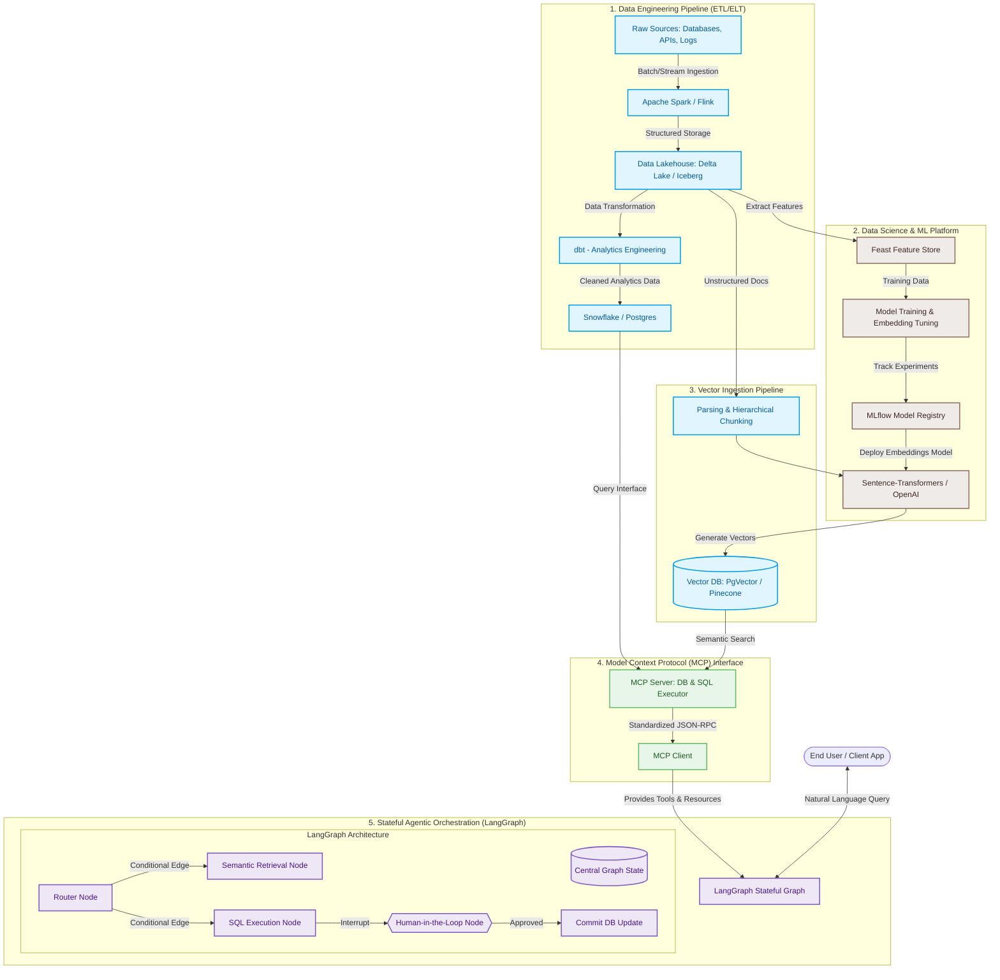

# 🚀 Advanced Agentic Workflows, MCP, and Enterprise Data Engineering

In the evolution of AI systems, we have transitioned from isolated, static Large Language Models (LLMs) to **dynamic, stateful, tool-enabled AI Agents** that actively interface with enterprise data. 

To build production-grade AI systems, developers must bridge the gap between **AI Orchestration Frameworks** (LangChain, LangGraph), **Data Access Protocols** (Model Context Protocol), and the core foundations of **Data Engineering & Data Science**.

This comprehensive master note details these components, their inner workings, and their architectural convergence.

---

## 🗺️ System Blueprint: The Unified AI & Data Architecture

The diagram below illustrates how raw enterprise data is ingested, structured, indexed, and dynamically queried by a stateful multi-agent system using standardized protocols.



---

## 🔌 1. Model Context Protocol (MCP) — The Universal Context Interface

### What is MCP?
The **Model Context Protocol (MCP)**, initiated by Anthropic, is an open standard designed to solve the integration nightmare of agentic AI. 

Traditionally, connecting an LLM to a tool (like a PostgreSQL database, Slack, or a local file system) required writing bespoke integration wrappers for every framework (LangChain, LlamaIndex, custom scripts) and every LLM API. **MCP standardizes this connection.** It behaves like the **Language Server Protocol (LSP)** in software development: instead of writing $M \times N$ integrations (where $M$ is the number of IDEs and $N$ is the number of programming languages), compilers implement a standard protocol, and IDEs implement standard clients.

MCP defines a standard communication layer between **Hosts** (e.g., Claude Desktop, Cursor, or your backend app), **Clients**, and **Servers**.

```
┌────────────────────────────────────────────────────────┐
│                        MCP HOST                        │
│  (Orchestrates LLM, manages UI, holds client context)  │
│                                                        │
│   ┌────────────────────────────────────────────────┐   │
│   │                   MCP CLIENT                   │   │
│   └───────────────────────┬────────────────────────┘   │
└───────────────────────────┼────────────────────────────┘
                            │ (JSON-RPC 2.0 over Stdio or SSE)
    ┌───────────────────────▼────────────────────────┐
    │                   MCP SERVER                   │
    │  (Exposes secure Resources, Prompts, & Tools)  │
    └────────────────────────────────────────────────┘
```

### Core Architecture Components
1. **MCP Host:** The execution environment (e.g., Claude Desktop, a custom LangGraph backend) that wants to utilize external tools and data via an LLM.
2. **MCP Client:** A component inside the host that establishes and maintains a secure, bidirectional protocol session with the server.
3. **MCP Server:** A lightweight, isolated process or microservice that exposes resources, prompt templates, and executable tools to the client.

### Key Protocols Features
MCP servers communicate with clients using a **JSON-RPC 2.0** protocol, typically over standard input/output (`stdio`) for local servers, or Server-Sent Events (`SSE`) for remote web servers. It exposes three primary primitives:

*   **Resources (Read-Only Data):** Standardized URIs (e.g., `postgres://db/schema` or `file:///logs/today.txt`) that allow the model to read raw data, schemas, or documentation.
*   **Prompts (Template Library):** Pre-packaged prompt layouts or system instructions that are dynamically populated with context by the server before execution.
*   **Tools (Actionable Functions):** Schemas of executable actions that the LLM can decide to run. The server performs the actual execution in its environment and returns the result to the client.

#### Why MCP is a Data Game-Changer
In an enterprise setup, the Data Engineering team can deploy a single secure **MCP Server** on top of a Snowflake or PostgreSQL warehouse. Any agent written in LangGraph, LangChain, or direct API calls can instantly query and interact with this data store safely, without developers having to write custom database connection tools for each individual agent.

---

## ⛓️ 2. LangChain — The Enterprise LLM Foundation

While agents represent the future, **LangChain** remains the foundational toolkit for assembling LLM components. Modern LangChain has evolved away from rigid, pre-packaged chains to a highly composable declarative programming paradigm called **LangChain Expression Language (LCEL)**.

### The Power of LCEL (LangChain Expression Language)
LCEL uses the Unix pipe operator (`|`) to chain together components. This approach offers several built-in benefits:
*   **Streaming Support:** Outputs are streamed as they become available.
*   **Async & Sync Compatibility:** Every LCEL chain natively supports synchronous methods (`invoke`) and asynchronous counterparts (`ainvoke`, `astream`).
*   **Parallel Execution:** Steps that do not depend on each other (such as fetching data from multiple vector databases) are run in parallel automatically.

### Core Building Blocks
1.  **Prompts (ChatPromptTemplate):** Structures raw inputs into formatted chat message sequences.
2.  **Models (ChatOpenAI / ChatAnthropic):** The underlying foundation models wrapped in a standard interface.
3.  **Output Parsers (JsonOutputParser / PydanticOutputParser):** Forces the model's text output into structured data formats, preventing runtime application crashes.

### Practical Implementation: Building an LCEL Data Extractor
Here is how you build a robust, schema-validated pipeline to extract structured data from unstructured enterprise documents using LCEL:

```python
from typing import List
from langchain_core.prompts import ChatPromptTemplate
from langchain_core.output_parsers import JsonOutputParser
from langchain_core.pydantic_v1 import BaseModel, Field
from langchain_openai import ChatOpenAI

# 1. Define the desired output schema using Pydantic
class DatabaseChangeRequest(BaseModel):
    table_name: str = Field(description="The database table name to be modified")
    action: str = Field(description="The database action: CREATE, ALTER, or DROP")
    columns: List[str] = Field(description="List of columns mentioned in the request")
    rationale: str = Field(description="Brief explanation of why this change is needed")

# 2. Initialize the Output Parser with our schema
parser = JsonOutputParser(pydantic_object=DatabaseChangeRequest)

# 3. Create the Prompt Template, injecting format instructions
prompt = ChatPromptTemplate.from_messages([
    ("system", "You are an expert Data Engineer assistant. Extract the structured database change request from the user message.\n{format_instructions}"),
    ("user", "{input_text}")
])

# 4. Bind the model and enforce structured output if supported
model = ChatOpenAI(model="gpt-4o", temperature=0)

# 5. Construct the LCEL Chain using the pipe (|) operator
extraction_chain = prompt | model | parser

# 6. Execute the chain
raw_request = "Can we add an email column (varchar 255) and a birth_date column (date) to the users table so we can run birthday marketing campaigns?"
result = extraction_chain.invoke({
    "input_text": raw_request,
    "format_instructions": parser.get_format_instructions()
})

print(result)
# Output: 
# {
#   'table_name': 'users', 
#   'action': 'ALTER', 
#   'columns': ['email', 'birth_date'], 
#   'rationale': 'To run birthday marketing campaigns'
# }
```

---

## 🕸️ 3. LangGraph — Stateful, Loop-Driven Agentic Orchestration

### The Limitation of Linear Chains
Classic LangChain (and standard LCEL) is designed for **directed acyclic graphs (DAGs)**. Data flows strictly forward. However, real-world agentic reasoning is iterative:
1. An agent attempts a task.
2. It executes a tool (e.g., runs a database query).
3. The tool returns an error or incomplete results.
4. The agent must loop back, reformulate its plan, and retry.

**LangGraph** solves this by modeling agents as a **State Machine**.

```
                        ┌───────────────┐
                        │   ┌───────┐   │
                        │   │ START │   │
                        │   └───┬───┘   │
                        │       ▼       │
                        │ ┌───────────┐ │
                        │ │ Agent/LLM │ │
                        │ └─────┬─────┘ │
                        └───────┼───────┘
                                │
                      (Conditional Routing)
                                │
               ┌────────────────┴────────────────┐
               │                                 │
      [Tool Executed?]                   [Task Finished?]
               │                                 │
               ▼                                 ▼
       ┌──────────────┐                   ┌─────────────┐
       │ Execute Tool │                   │   Finished  │
       └───────┬──────┘                   └─────────────┘
               │                                 
               └─────────────────────────────────┘
```

### Core Concepts of LangGraph
*   **State:** A central, shared data structure (often represented as a subclass of `TypedDict` or `Pydantic BaseModel`) representing the agent's short-term memory. Every node in the graph can read from and write to this state.
*   **Nodes:** Standard Python functions (sync or async) that receive the current `State` as input, perform work, and return an updated dictionary to mutate the State.
*   **Edges:** Define the routing between nodes.
    *   *Normal Edges:* Connect Node A directly to Node B.
    *   *Conditional Edges:* Evaluate a custom function to determine which node to call next based on the current state (e.g., checking if the LLM output suggests calling a tool or returning to the user).
*   **Checkpointers (Memory & Time Travel):** Built-in persistence engines that save the graph state after every node execution. This enables **State Persistence** (retaining memory across multiple sessions) and **Time Travel** (rewinding to a previous state, modifying the course, and re-executing).
*   **Human-in-the-Loop:** The ability to pause the graph execution before a specific node (like running a database write operation), prompt a human for approval, and resume once authorized.

### Multi-Agent Interaction Topologies
When tasks become complex, a single agent model degrades. LangGraph excels at orchestrating multiple specialized agents:

| Pattern | Description | Best For |
| :--- | :--- | :--- |
| **Supervisor Pattern** | A centralized coordinator LLM acts as a manager, delegating tasks to dedicated sub-agents and compiling their outputs. | Complex tasks requiring strict orchestration and delegation rules. |
| **Network (Peer-to-Peer)** | Specialized agents pass messages directly to each other without a central controller, collaborating dynamically. | Open-ended collaborative tasks (e.g., code writer and tester). |
| **Hierarchical Teams** | A supervisor agent controls sub-teams of agents. Each sub-team has its own local supervisor directing specialized workers. | Multi-faceted enterprise software engineering or massive data analysis. |

---

## 📊 4. Data Engineering & Data Science — The AI Foundation

An AI agent is only as good as the data it accesses. Without solid Data Engineering (DE) and Data Science (DS), LLMs suffer from severe limitations in enterprise retrieval accuracy, operational costs, and scalability.

```
┌─────────────────────────────────────────────────────────────────────────────┐
│                          THE DATA FEEDBACK LOOP                             │
│                                                                             │
│  ┌───────────────────────┐ Ingest & Transform ┌──────────────────────────┐  │
│  │   DATA ENGINEERING    ├───────────────────►│       DATA SCIENCE       │  │
│  │ (Pipelines, Warehouses)│                   │(Models, Feature Stores)  │  │
│  └───────────▲───────────┘                    └────────────┬─────────────┘  │
│              │                                             │                │
│              │ Expose Clean Data                           │ Build Embeddings &│
│              │                                             │ Predictions    │
│              │                                             ▼                │
│  ┌───────────┴───────────┐    Dynamic Query   ┌──────────────────────────┐  │
│  │       MCP SERVER      │◄───────────────────┤     LANGGRAPH AGENT      │  │
│  │   (Secure Interfaces) │                    │  (Stateful reasoning)    │  │
│  └───────────────────────┘                    └──────────────────────────┘  │
└─────────────────────────────────────────────────────────────────────────────┘
```

### Data Engineering: Constructing the AI Pipelines
Data Engineering builds the pipeline infrastructure that feeds clean data to Vector Databases and provides structural schemas to agent tools.

*   **ETL vs. ELT:** 
    *   **ETL (Extract, Transform, Load):** Transforming data *before* storing it (best for sensitive data removal or highly legacy databases).
    *   **ELT (Extract, Load, Transform):** Ingesting raw data directly into high-scale Cloud Lakehouses (e.g., Snowflake, Delta Lake) and performing heavy transformations there using tools like **dbt** (Data Build Tool) or **Apache Spark**. Modern GenAI prefers ELT because unstructured documents can be loaded raw, and chunked/embedded downstream in parallel pipelines.
*   **Data Lakehouse Architecture:** Merging the low cost and raw-file support of Data Lakes (AWS S3, Azure Data Lake Store) with the ACID compliance, schema enforcement, and SQL engine efficiency of traditional Data Warehouses. Technologies like **Delta Lake** and **Apache Iceberg** act as the single source of truth for both analytics and GenAI context.
*   **Pipeline Orchestration:** Workflow tools (like **Apache Airflow**, **Prefect**, or **Dagster**) guarantee that text data is re-chunked, embedded, and re-indexed in vector databases whenever original files are modified in enterprise source systems.

### Data Science: Optimizing Cognitive Performance
Data Science focuses on feature engineering, tuning retrieval quality, and fine-tuning models to perform specific tasks.

*   **Feature Stores (e.g., Feast):** A centralized repository that stores consistent, curated features for both real-time model inference and historical offline training.
*   **Custom Embedding Pipelines:** Off-the-shelf embedding models (like OpenAI's text-embedding-3-small) fail in highly specialized domains (e.g., medical, legal, niche industrial domains). Data Scientists fine-tune embedding models (using Siamese networks or contrastive loss) to ensure similar semantic concepts cluster correctly.
*   **Fine-Tuning Techniques (SFT & PEFT):**
    *   **SFT (Supervised Fine-Tuning):** Teaching an open-source model (like Llama 3) a specific conversational tone or schema-following capability.
    *   **LoRA / QLoRA (Parameter-Efficient Fine-Tuning):** Freezing the base LLM weights and training small adapter layers. This slashes memory footprints and training costs by up to 90%.
*   **Evaluation Frameworks (Ragas, TruLens):** Measuring GenAI effectiveness using metrics like **Faithfulness** (does the answer contain hallucinations?), **Answer Relevance** (did the LLM address the query?), and **Context Precision** (did the retriever pull correct chunks?).

---

## 🔌 5. The Core Connections: How It All Ties Together

Production-grade AI systems do not live in isolation. They form a continuous loop combining Data Engineering pipelines, Data Science optimizations, and stateful agentic workflows.

### 1. Feeding the Vector Database (Data Engineering $\to$ Vector DB)
Raw documents (PDFs, Confluence pages, Markdown notes) are extracted by Data Engineering tools (e.g., Airflow executing Spark/Python scripts). 
The data is parsed, chunked, and pushed to embedding models configured by Data Scientists. 
The resulting high-dimensional vectors are loaded into a Vector Database (like **pgvector** or **Pinecone**). This database serves as the primary external long-term memory for our agents.

### 2. Standardizing Access via MCP (Data Systems $\to$ MCP Server)
Instead of having the AI framework directly execute raw SQL queries or fetch files from the filesystem via ad-hoc wrappers, we package our enterprise databases and vector retrieval systems behind **MCP Servers**. 
The MCP Server defines a clear, secure API contracts. For example, a PostgreSQL MCP server might expose a tool called `run_query` and a resource called `database_schema`. 

### 3. Stateful Execution in LangGraph (MCP Client $\to$ LangGraph Agent)
The LangGraph workflow operates as an **MCP Client**. 
When a user asks a complex natural language question ("What is our highest-grossing product, and can you generate a summary email for the team?"), the LangGraph agent uses the MCP client to dynamically inspect the database schema (Resource), formulate a SQL query, and execute it using the query tool (Tool).

If the agent needs human approval before performing a high-risk operation (e.g., altering a database table or sending the email), LangGraph pauses execution, persists the state to a checkpointer, and awaits user confirmation.

---

## 🛠️ Deep-Dive Project: Creating a Stateful Database Agent with LangGraph & MCP-Style Tools

Let's build a functional, stateful database assistant using LangGraph. It will track agent state, run SQL queries against a local database, handle dynamic routing, and employ validation safeguards.

```python
import sqlite3
from typing import TypedDict, Annotated, Sequence, Literal
from langchain_core.messages import BaseMessage, HumanMessage, AIMessage, ToolMessage
from langchain_core.tools import tool
from langchain_openai import ChatOpenAI
from langgraph.graph import StateGraph, START, END
from langgraph.graph.message import add_messages
from langgraph.prebuilt import ToolNode

# ==========================================
# 1. SETUP DATABASE & TOOLS (Simulated MCP Server)
# ==========================================

# Create an in-memory SQLite database representing a classic Data Engineering warehouse
conn = sqlite3.connect(":memory:", check_same_thread=False)
cursor = conn.cursor()
cursor.execute("""
CREATE TABLE IF NOT EXISTS product_revenue (
    product_id INTEGER PRIMARY KEY,
    product_name TEXT,
    revenue REAL,
    quarter TEXT
)
""")
cursor.executemany("INSERT INTO product_revenue VALUES (?, ?, ?, ?)", [
    (1, "Cloud Analytics Platform", 1250000.00, "Q1-2026"),
    (2, "AI Vector Processor", 4500000.00, "Q1-2026"),
    (3, "Serverless Ingestion Pipeline", 850000.50, "Q1-2026"),
    (4, "Enterprise Data Catalog", 1100000.00, "Q2-2026")
])
conn.commit()

@tool
def execute_sql_query(query: str) -> str:
    """Executes a SQL query against the enterprise data warehouse database and returns the rows as a string.
    Only read queries (SELECT) are permitted.
    """
    cleaned_query = query.strip().lower()
    if not cleaned_query.startswith("select"):
        return "Error: Security violation! Only SELECT operations are allowed on this warehouse interface."
    
    try:
        cursor.execute(query)
        rows = cursor.fetchall()
        return str(rows)
    except Exception as e:
        return f"Error executing SQL: {str(e)}"

# Define tool directory
tools = [execute_sql_query]
tool_node = ToolNode(tools)

# ==========================================
# 2. DEFINE AGENT STATE
# ==========================================

class AgentState(TypedDict):
    # Annotate messages with add_messages, which appends new messages to the list
    messages: Annotated[Sequence[BaseMessage], add_messages]

# ==========================================
# 3. BUILD AGENT LOGIC & NODES
# ==========================================

# Initialize our reasoning model
model = ChatOpenAI(model="gpt-4o", temperature=0.1).bind_tools(tools)

def call_model(state: AgentState):
    """The central LLM reasoning node."""
    messages = state["messages"]
    response = model.invoke(messages)
    return {"messages": [response]}

# Conditional routing logic to determine next step
def should_continue(state: AgentState) -> Literal["tools", "__end__"]:
    """Inspects the last message to decide if we route to ToolNode or exit."""
    messages = state["messages"]
    last_message = messages[-1]
    
    # If the LLM made a tool call, route to tools
    if last_message.tool_calls:
        return "tools"
    
    # Otherwise, stop execution and return to user
    return "__end__"

# ==========================================
# 4. COMPILE THE STATEGRAPH
# ==========================================

# Define Graph structure
workflow = StateGraph(AgentState)

# Add our processing Nodes
workflow.add_node("agent", call_model)
workflow.add_node("tools", tool_node)

# Set the Entrypoint
workflow.add_edge(START, "agent")

# Add a Conditional Edge routing from agent to either tools or end
workflow.add_conditional_edges(
    "agent",
    should_continue,
)

# Connect tools back to agent to handle iterative reasoning loops
workflow.add_edge("tools", "agent")

# Compile with a simple memory checkpointer for state persistence
from langgraph.checkpoint.memory import MemorySaver
memory = MemorySaver()
app = workflow.compile(checkpointer=memory)

# ==========================================
# 5. RUN THE SYSTEM
# ==========================================

config = {"configurable": {"thread_id": "analytics_session_1"}}

print("\n--- Starting Stateful Agent Run ---")
user_input = "Which product brought in the highest revenue in Q1-2026? Provide the exact name and amount."
print(f"User: {user_input}\n")

# Run the agent in streaming mode
events = app.stream({"messages": [HumanMessage(content=user_input)]}, config)
for event in events:
    for node, output in event.items():
        print(f"--- Finished Node: {node} ---")
        if "messages" in output:
            last_msg = output["messages"][-1]
            if isinstance(last_msg, AIMessage) and last_msg.content:
                print(f"Agent Response: {last_msg.content}")
            elif isinstance(last_msg, ToolMessage):
                print(f"Tool Result: {last_msg.content}")
            elif isinstance(last_msg, AIMessage) and last_msg.tool_calls:
                print(f"Agent Tool Request: {last_msg.tool_calls}")

# The agent successfully:
# 1. Analyzed the query.
# 2. Formulated a SELECT SQL statement.
# 3. Executed it via sqlite3.
# 4. Used the context returned from the database to generate a final answer.
# 5. Kept track of all previous statements inside its state memory.
```

---

## 💎 Key Takeaways for Technical Mastery

1. **Decoupled Architecture:** Always separate **Data Storage/Transformation** (Data Engineering/Spark/dbt) from **AI Orchestration** (LangGraph). Use standardized API layers like **MCP** to secure and simplify the data exchange.
2. **Statefulness over Chains:** For enterprise apps, default to stateful graphs (`LangGraph`) instead of linear chains. This guarantees error handling, dynamic fallback routing, and human approval capabilities.
3. **Data Science is the differentiator:** Standard models fail at domain-specific context. Enterprise value comes from fine-tuned embeddings, clean feature stores, and dedicated fine-tuned adapters (LoRA/QLoRA) working in harmony with agent pipelines.
